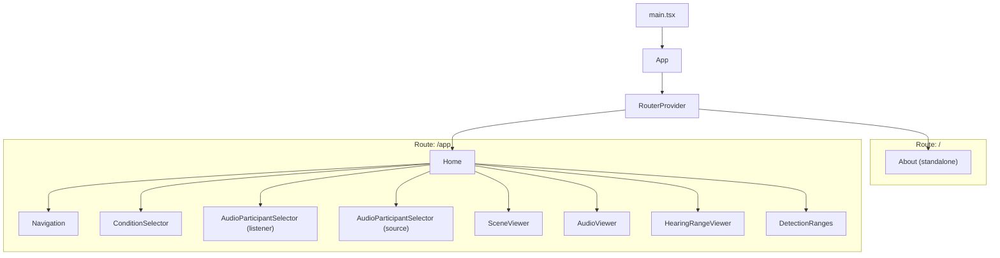
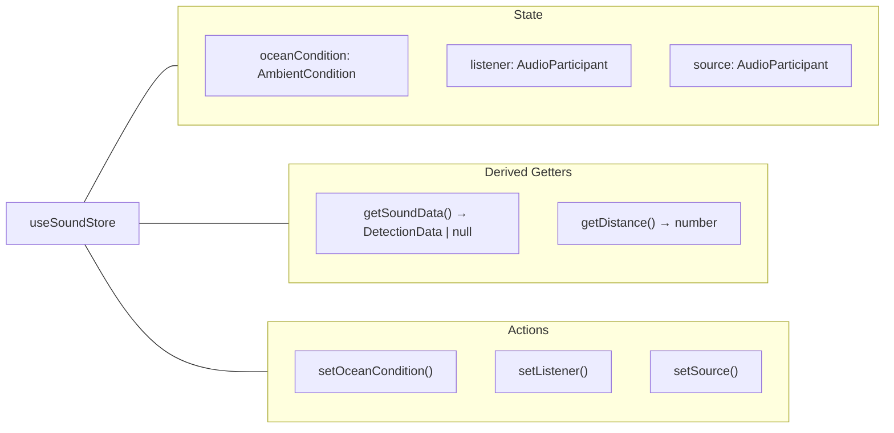

# Architecture

SensingSound is an interactive web application about underwater acoustics in Monterey Bay. Users explore how far marine animals can detect sounds under different ocean conditions (calm seas, wind and waves, storms, cruise ship noise).

**Stack:** React 18, TypeScript, Vite 6, Tailwind CSS v4, React Router 7, Zustand 5, Lucide icons.
**Deployment:** GitHub Pages via GitHub Actions, with SPA fallback through `dist/404.html`.

---

## Project Structure

```
src/
├── main.tsx                          # Entry point: applies color palette, mounts <App />
├── vite-env.d.ts                     # Vite client types + *.m4a module declaration
├── app/
│   ├── App.tsx                       # Root component: <RouterProvider>
│   ├── routes.ts                     # Route definitions (/ and /app)
│   ├── types/
│   │   └── index.ts                  # Domain types: AmbientCondition, Noise, DetectionData, AudioParticipant
│   ├── store/
│   │   └── useSoundStore.ts          # Zustand store: oceanCondition, listener, source + derived getters
│   ├── data/
│   │   └── participants.ts           # AudioParticipant registry (4 animals, detection data, listens_to wiring)
│   ├── utils/
│   │   └── formatting.ts            # Shared helpers: formatDistance, formatAnimalLabel, getSoundFullName, etc.
│   ├── config/
│   │   ├── applyColorPalette.ts      # Flattens colorPalette.json into --ss-* CSS vars at runtime
│   │   └── colorPalette.json         # Design token values (surface, text, accent colors)
│   ├── pages/
│   │   ├── Home.tsx                  # Main dashboard: vertical stack of 6 components
│   │   └── About.tsx                 # Project background, science, credits
│   └── components/
│       ├── Navigation.tsx            # Fixed logo + nav links (About, App)
│       ├── ConditionSelector.tsx     # Ocean condition picker (slider + buttons)
│       ├── AudioParticipantSelector.tsx  # Carousel selector with listener/source variants
│       ├── SceneViewer.tsx           # Underwater scene with listener, source, distance pill
│       ├── AudioViewer.tsx           # Audio player with spectrogram visualization
│       ├── HearingRangeViewer.tsx    # Frequency hearing range chart
│       ├── DetectionRanges.tsx       # Log-scale bar chart with listener group chips
│       ├── figma/ImageWithFallback.tsx
│       └── ui/                       # ~35 shadcn-style primitives (none imported by app)
├── imports/
│   └── Frame8.tsx                    # Original hearing ranges chart (superseded by HearingRangeViewer)
├── assets/                           # Images, audio files, spectrograms
└── styles/
    ├── index.css                     # Main CSS: imports + .ss-* custom classes + animations
    ├── tailwind.css                  # Tailwind v4 entry + tw-animate-css
    ├── theme.css                     # Light/dark theme vars, @theme inline block, base typography
    └── fonts.css                     # Empty (imported but unused)
```

---

## Component Hierarchy and Routes

### Routes

Two flat routes are defined in `src/app/routes.ts` using `createBrowserRouter` from React Router 7. There is no shared layout wrapper -- each page is standalone.

| Path     | Component | Description                              |
|----------|-----------|------------------------------------------|
| `/`      | `About`   | Static content about the project, science, collaborators, and funders |
| `/app`   | `Home`    | Interactive dashboard with selectors, visualization, and bar chart |

The router uses `import.meta.env.BASE_URL` as its basename to support the `/sensing-sound/` subpath on GitHub Pages.

### Component Tree



All components in the `/app` route read from and write to the Zustand store directly. `Home` contains no state -- it is a pure layout component that stacks the six sections vertically.

---

## State Management

### Zustand Store (`useSoundStore`)

The application's core state is managed by a single Zustand store. There is no prop drilling; each component subscribes to the slices it needs.



| State field      | Type                | Default       | Description |
|------------------|---------------------|---------------|-------------|
| `oceanCondition` | `AmbientCondition`  | `"winter"`    | Current ocean noise context |
| `listener`       | `AudioParticipant`  | Harbor Seal   | The marine animal doing the listening |
| `source`         | `AudioParticipant`  | Rockfish      | The animal producing the sound |

**Derived values** (computed via `get()`):
- `getSoundData()` -- looks up `listener.detections[source.id]`, returning the `DetectionData` for the current pair or `null` if the pairing is invalid.
- `getDistance()` -- reads `getSoundData()[oceanCondition]`, returning the detection distance in km for the current condition.

### Component Store Access

| Component                    | Reads                                        | Writes                       |
| ---------------------------- | -------------------------------------------- | ---------------------------- |
| **ConditionSelector**        | `oceanCondition`                             | `setOceanCondition`          |
| **AudioParticipantSelector** | `listener` or `source` (via `variant` prop)  | `setListener` or `setSource` |
| **SceneViewer**              | `listener`, `source`, `oceanCondition`, `getDistance()` | --              |
| **AudioViewer**              | `source` (for `.noise`)                      | --                           |
| **HearingRangeViewer**       | `listener` (to highlight active range)       | --                           |
| **DetectionRanges**          | all state + derived                          | `setListener`, `setSource`   |

**AudioViewer** keeps audio playback state (isPlaying, progress, duration, muted) as local component state since it is UI-only and not shared.

---

## Domain Types

All domain types live in `src/app/types/index.ts`:

```typescript
type AmbientCondition = "calm" | "winter" | "storm" | "cruiseShip";

interface Noise {
  audioFile: string;       // path to .wav/.m4a audio asset
  spectrogram: string;     // path to spectrogram .png asset
}

interface DetectionData {
  peakFrequency: number;
  thirdOctaveBand: number;
  calm: number;            // detection distance in km
  winter: number;
  storm: number;
  cruiseShip: number;
}

interface AudioParticipant {
  id: string;              // e.g. "harbor-seal", "rockfish"
  name: string;            // display name e.g. "Harbor Seal"
  icon: string;            // path to animal icon asset
  scientificName: string;  // e.g. "Phoca vitulina"
  source: boolean;         // can this animal produce sounds?
  listener: boolean;       // can this animal detect sounds?
  noise: Noise;            // the sound this animal produces
  listens_to: AudioParticipant[];            // valid source pairings
  detections: Record<string, DetectionData>; // keyed by source participant id
}
```

### Participant Registry (`participants.ts`)

Four `AudioParticipant` objects are defined and exported:

| Participant        | `source` | `listener` | `listens_to` count | `detections` entries |
|--------------------|----------|------------|---------------------|----------------------|
| Rockfish           | true     | false      | 0                   | 0                    |
| Harbor Seal        | true     | true       | 4                   | 4                    |
| Bottlenose Dolphin | true     | true       | 2                   | 2                    |
| Killer Whale       | true     | true       | 3                   | 3                    |

Objects are created first with empty `listens_to`/`detections`, then wired up post-creation to handle circular references. The module also exports `allParticipants`, `listeners` (filtered to `listener: true`), and `sources` (filtered to `source: true`).

---

## CSS Architecture

### Style Stack

Styles flow through four layers:

1. **Tailwind CSS v4** (`src/styles/tailwind.css`) -- utility-first classes applied via `className`. Loaded through `@tailwindcss/vite` plugin. Includes `tw-animate-css` for animation utilities.

2. **Theme variables** (`src/styles/theme.css`) -- defines light and dark mode CSS custom properties (`--background`, `--foreground`, `--primary`, etc.), maps them to Tailwind via `@theme inline`, and sets base typography for `h1`--`h4`, `label`, `button`, and `input`.

3. **App-specific classes** (`src/styles/index.css`) -- custom `.ss-*` classes for the SensingSound design system, slider thumb styling, and keyframe animations.

4. **Runtime palette** (`applyColorPalette.ts`) -- flattens `colorPalette.json` into `--ss-*` CSS custom properties on `document.documentElement.style` at startup, overriding the static defaults in `index.css`.

### Custom Properties

The `--ss-*` namespace covers the app's visual identity:

| Category   | Examples                                                        |
|------------|-----------------------------------------------------------------|
| Surfaces   | `--ss-surface-panel-start`, `--ss-surface-panel-end`, `--ss-surface-overlay-*` |
| Text       | `--ss-text-primary`, `--ss-text-muted`, `--ss-text-subtle`     |
| Accent     | `--ss-accent-primary`, `--ss-accent-primary-soft`, `--ss-accent-primary-hover` |
| State      | `--ss-state-calm`, `--ss-state-winter`, `--ss-state-storm`, `--ss-state-cruise-ship` (+ `-solid` variants) |
| Bars       | `--ss-bar-active`, `--ss-bar-reference`, `--ss-bar-calm`, etc. |
| Signals    | `--ss-signal-listener-ring`, `--ss-signal-source-ring`, `--ss-signal-flow-dot` |

### Animations

Four keyframe animations drive the listening scene visualization:

- **`flow-right-to-left`** -- sound-flow dots traveling from source to listener.
- **`listener-inbound`** -- concentric rings contracting toward the listener.
- **`source-outbound`** -- concentric rings expanding from the sound source.
- **`invalid-backdrop-fade` / `invalid-lightbox-fade`** -- timed fade-in/fade-out for invalid pairing notices.

### Methodology

- **Tailwind utility-first** for the majority of layout and styling via `className`.
- **Custom `.ss-*` semantic classes** for app-specific tokens (panels, bars, selections).
- **CVA (class-variance-authority)** + `cn()` (clsx + tailwind-merge) in `ui/` components.
- **Inline `style` attributes** for dynamic values: carousel transforms, slider colors, flex ratios, bar chart heights.
- **No CSS Modules** and no BEM. No use of MUI/Emotion despite their presence in `package.json`.

---

## Responsive Design: Current State and Improvement Areas

### Current Breakpoints

The app uses standard Tailwind breakpoints:

| Breakpoint | Width   | Usage                                           |
|------------|---------|--------------------------------------------------|
| `sm`       | 640px   | Navigation gap spacing                          |
| `md`       | 768px   | About page grid                                 |
| `lg`       | 1024px  | Detection ranges listener chips visibility      |

### Layout

`Home` uses a single-column vertical stack (`flex flex-col gap-4`) constrained to `max-w-5xl` with the ocean gradient background. All components flow naturally in document order. The listener group chips in `DetectionRanges` are hidden below `lg` (`hidden lg:flex`).

### Areas for Improvement

#### 1. Visualization Scene -- Fixed Element Sizes

The listener/source scene uses `w-44 h-44` (176px) circles with `absolute` positioning at `left-1/3` and `left-2/3`. These do not scale on narrow viewports. On screens below ~500px, the circles overlap or clip.

**Suggestion:** Use percentage-based or `clamp()`-based sizing, e.g. `w-[min(11rem,35vw)]`, and ensure the absolute-positioned elements reflow or stack vertically on small screens.

#### 2. Bar Chart -- Horizontal Scroll on Mobile

The bar chart container uses `min-w-[34rem]` (544px) with `overflow-x-auto`, forcing horizontal scroll on any screen narrower than that.

**Suggestion:** On small screens, consider either reducing `min-width` and allowing narrower bars, switching to a horizontal bar chart, or showing a simplified subset of the data.

#### 3. Hearing Ranges -- No Breakpoints

The hearing ranges panel uses `grid-cols-[52px_1fr]` and `grid-cols-5` with fixed font sizes and no responsive adjustments. The frequency labels and range bars become cramped below ~400px width.

**Suggestion:** Add `sm:` or `md:` breakpoints to reduce grid columns or switch to a vertically stacked layout on narrow viewports.

#### 4. Context Knob -- Fixed Height

The context selector uses `h-[25rem]` (400px) for the vertical slider and option grid. This exceeds the visible area on short or landscape mobile viewports.

**Suggestion:** Use `max-h-[60vh]` or similar viewport-relative units, or collapse the slider into a simpler control on mobile.

#### 5. Listener Group Chips -- Hidden on Mobile

The listener group chips below the bar chart (`hidden lg:flex`) are completely hidden below `lg`. There is no alternative representation of this information on mobile.

**Suggestion:** Provide a compact version of the listener labels on mobile, or integrate the listener context into the bar chart's x-axis labels.
